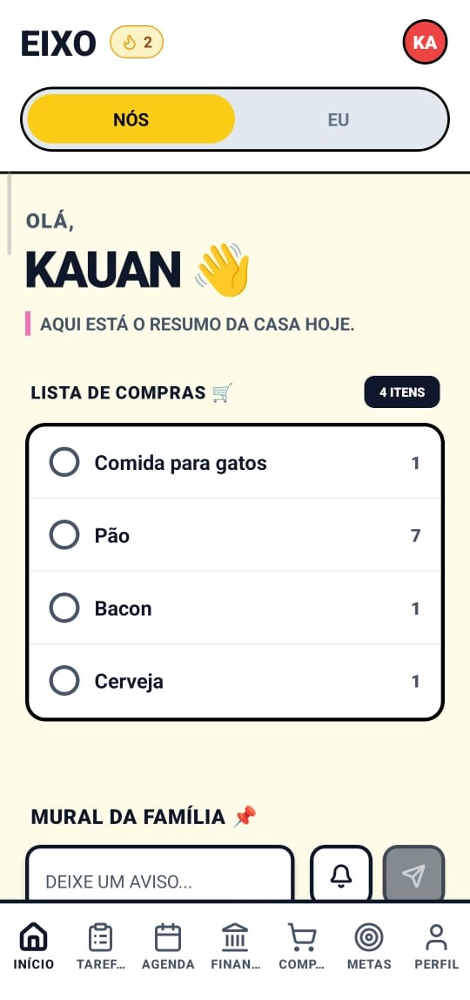
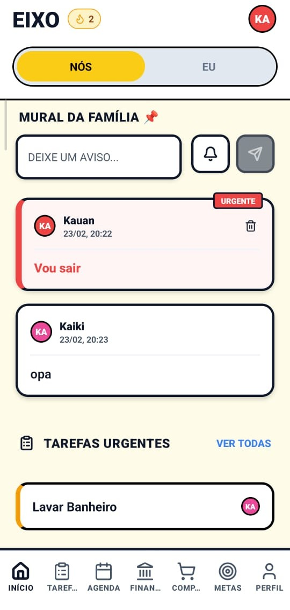
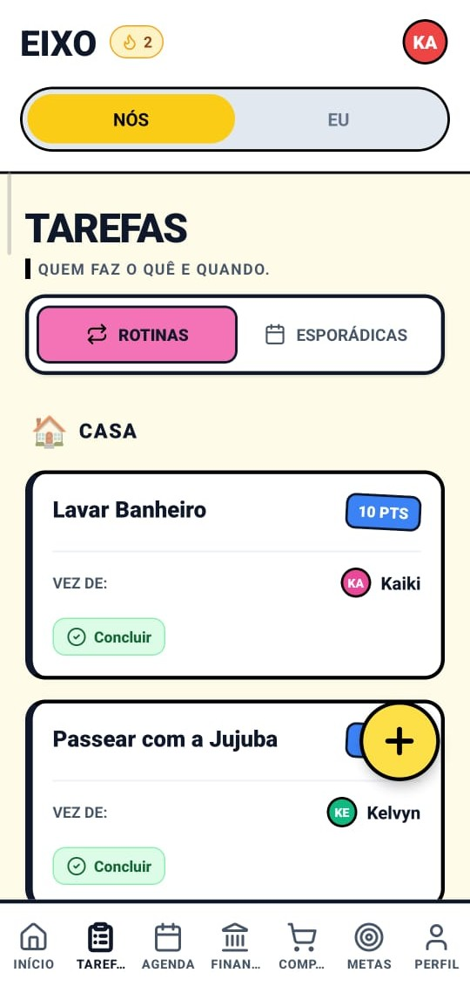
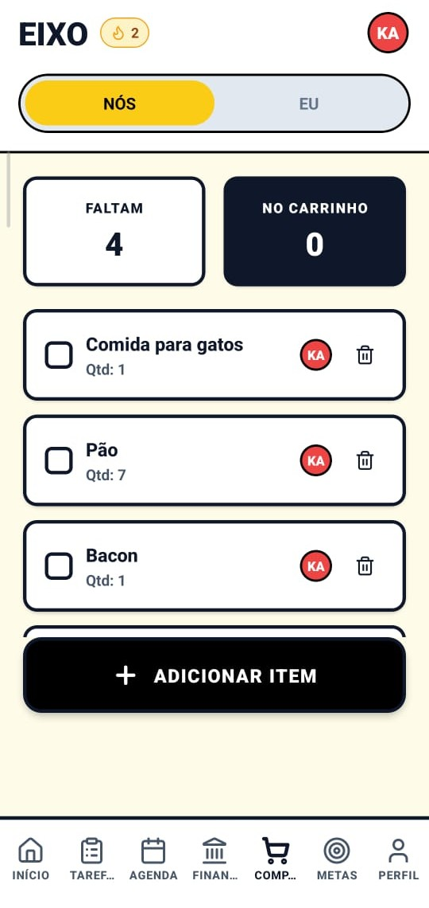
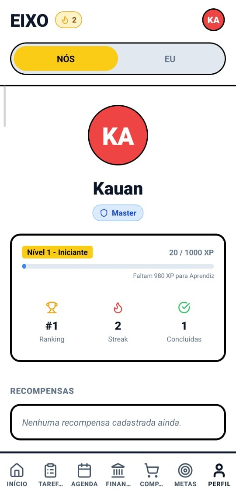
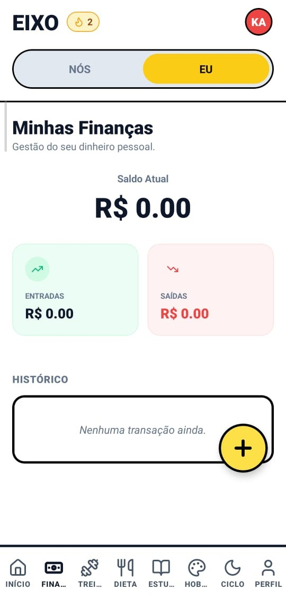
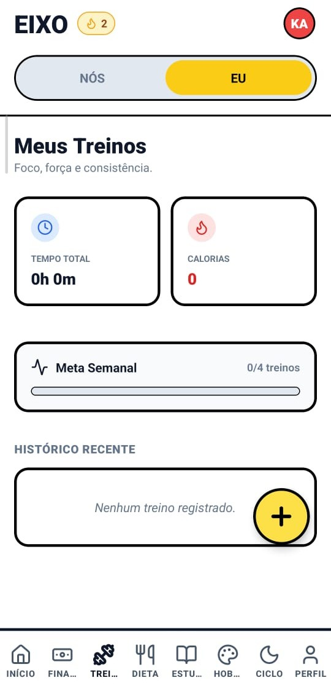
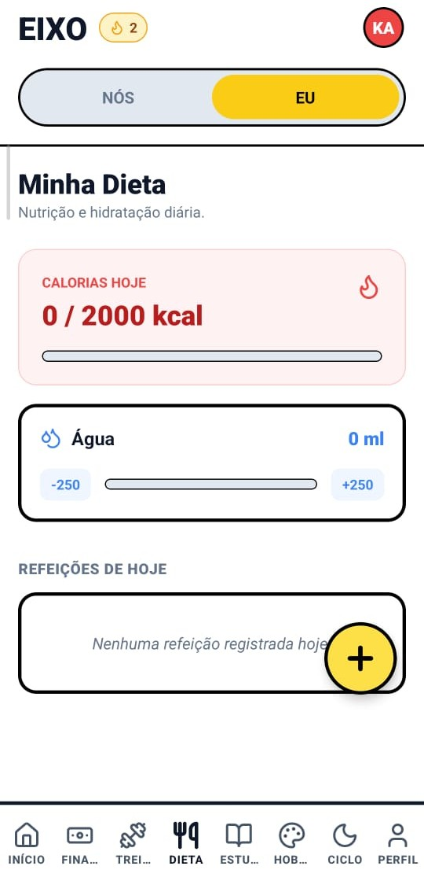
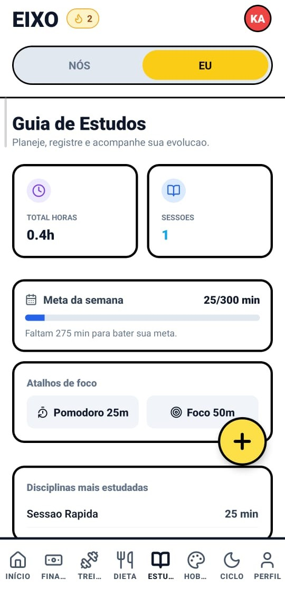
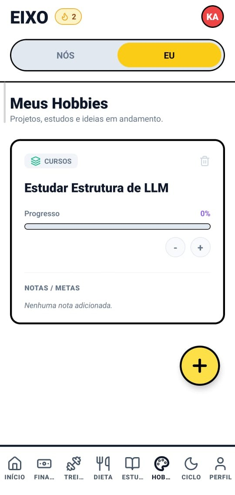

# Eixo 🏠

<div align="center">

**Aplicativo de gerenciamento familiar gamificado**

*Organize tarefas, finanças e rotina da família de forma divertida e colaborativa*

[English Version](#eixo---english-version)

</div>

---

## 📱 O que é o Eixo?

O **Eixo** é um aplicativo completo para gerenciamento familiar que transforma a organização do dia a dia em uma experiência gamificada. Cada membro da família pode acompanhar tarefas, finanças, metas e muito mais, enquanto ganha pontos e sobe de nível!

### ✨ Filosofia

O nome "Eixo" representa o centro em torno do qual a família gira - um ponto de equilíbrio que mantém todos conectados e organizados. O app funciona em dois modos:

- **Modo NÓS** 👨‍👩‍👧‍👦 - Recursos compartilhados da família
- **Modo EU** 👤 - Recursos pessoais de cada membro

---

## 🚀 Features

### 👨‍👩‍👧‍👦 Modo Família (NÓS)

#### 📋 Tarefas Inteligentes
- Tarefas de **rotina** e **esporádicas**
- Frequência diária/semanal/mensal ou data específica
- Distribuição **automática** (rotação) ou **manual** por calendário
- Definição de ordem inicial dos responsáveis
- Pontuação por tarefa, conclusão rápida e atualização de XP/streak

#### 💰 Finanças da Casa
- **Despesas** com rateio entre membros
- **Receitas** por responsável
- **Dívidas** com parcelamento, progresso e ação de pagamento
- **Assinaturas** recorrentes com vencimento
- **Metas familiares** (financeiras ou gerais) com contribuições, notas e histórico

#### 📅 Agenda Compartilhada
- Eventos familiares e pessoais
- Criação, edição e exclusão de eventos
- Campos de data, hora, local, descrição e tipo

#### 🛒 Compras e Mural
- Lista de compras com controle em tempo real e autoria dos itens
- Mural da família com avisos normais e **urgentes**
- Exclusão de avisos pelo autor

#### 👥 Gestão da Família
- Cadastro de novos membros pelo app (nome + PIN)
- Papéis familiares: **master**, **admin** e **member**
- Edição de relação familiar (ex.: Pai, Mãe, Filho)
- Remoção de membros com regras de permissão

#### 🏆 Gamificação
- Pontos, XP, níveis e leaderboard
- Recompensas resgatáveis por pontos
- Streak e total de tarefas concluídas

---

### 👤 Modo Pessoal (EU)

#### 🧭 Dashboard Pessoal
- Resumo de saldo, treinos, calorias, estudos e ciclo (opcional)
- Atalhos rápidos para os módulos pessoais

#### 💳 Finanças Pessoais
- Lançamentos de entrada/saída com categoria e descrição
- Saldo individual consolidado

#### 🧘 Saúde e Rotina
- **Treinos** com duração, intensidade, calorias e meta semanal
- **Dieta** com meta de calorias e hidratação
- **Ciclo** opcional com previsão e histórico de sintomas/fluxo

#### 📚 Desenvolvimento
- **Estudos** com meta semanal e atalhos (`Pomodoro 25m` e `Foco 50m`)
- **Hobbies** com progresso percentual e notas/metas

---

## 🖼️ Prints das Funcionalidades

### 👨‍👩‍👧‍👦 Modo NÓS (Família)

| Tela | Preview |
|------|---------|
| Início: resumo da casa, lista de compras e atalhos da família |  |
| Mural da família com avisos e tarefas urgentes |  |
| Tarefas domésticas com rotinas, responsáveis e pontos |  |
| Lista de compras compartilhada com controle de itens |  |
| Perfil com nível, XP, streak e ranking |  |

### 👤 Modo EU (Pessoal)

| Tela | Preview |
|------|---------|
| Minhas finanças: saldo, entradas, saídas e histórico |  |
| Meus treinos: meta semanal, tempo total e calorias |  |
| Minha dieta: calorias, hidratação e refeições do dia |  |
| Guia de estudos: sessões, horas e metas semanais |  |
| Meus hobbies: projetos pessoais com progresso e metas |  |

---

## 🏗️ Arquitetura

```
Eixo/
├── frontend/               # React Native + Expo
│   └── src/
│       ├── components/     # Componentes reutilizáveis
│       ├── screens/        # Telas do app
│       ├── context/        # Estado global (AppContext)
│       └── services/       # API, SignalR e Push
│
└── backend/                # .NET 10 Web API
    ├── Eixo.Api/          # Controllers e Hubs
    ├── Eixo.Core/         # Entidades de domínio
    └── Eixo.Infrastructure/# EF Core + SQLite
```

---

## 🔧 Tecnologias

### Frontend
- **React Native** + Expo
- **TypeScript**
- **Lucide Icons**
- **SignalR** (real-time)
- **Expo Notifications** (push)
- **AsyncStorage** (auth)

### Backend
- **.NET 10** Web API
- **Entity Framework Core**
- **SQLite**
- **SignalR** (WebSockets)
- **JWT** Authentication

---

## 📡 API Endpoints

### Autenticação
| Método | Rota | Descrição |
|--------|------|-----------|
| POST | `/api/auth/login` | Login com PIN |
| POST | `/api/auth/register` | Cadastro de novo membro |
| GET | `/api/auth/me` | Usuário atual |
| GET | `/api/auth/validate` | Validar token |

### Usuários
| Método | Rota | Descrição |
|--------|------|-----------|
| GET | `/api/users` | Listar usuários |
| GET | `/api/users/leaderboard` | Ranking |
| GET | `/api/users/{id}/settings` | Buscar configurações |
| PUT | `/api/users/{id}/settings` | Atualizar configurações |
| PUT | `/api/users/{id}/family-profile` | Atualizar papel/relação |
| DELETE | `/api/users/{id}` | Remover usuário |

### Tarefas
| Método | Rota | Descrição |
|--------|------|-----------|
| GET | `/api/tasks` | Listar tarefas |
| POST | `/api/tasks` | Criar tarefa |
| PUT | `/api/tasks/{id}` | Atualizar tarefa |
| DELETE | `/api/tasks/{id}` | Excluir tarefa |
| POST | `/api/tasks/{id}/complete` | Completar |

### Finanças
| Método | Rota | Descrição |
|--------|------|-----------|
| GET/POST | `/api/expenses` | Despesas |
| GET/POST | `/api/incomes` | Receitas |
| GET/POST | `/api/debts` | Dívidas |
| POST | `/api/debts/{id}/pay` | Pagar parcela |
| GET/POST | `/api/subscriptions` | Assinaturas |
| GET/POST | `/api/goals` | Metas |
| POST | `/api/goals/{id}/contribute` | Contribuir |

### Agenda, Avisos e Notificações
| Método | Rota | Descrição |
|--------|------|-----------|
| GET/POST | `/api/shopping` | Lista de compras |
| PUT | `/api/shopping/{id}/toggle` | Marcar item comprado |
| GET/POST | `/api/events` | Eventos |
| PUT | `/api/events/{id}` | Atualizar evento |
| GET/POST | `/api/notices` | Avisos do mural |
| GET | `/api/notifications` | Listar notificações |
| PUT | `/api/notifications/{id}/read` | Marcar notificação lida |
| POST | `/api/notifications/devices/register` | Registrar token push |
| POST | `/api/notifications/devices/unregister` | Remover token push |

### Recompensas e Modo EU
| Método | Rota | Descrição |
|--------|------|-----------|
| GET/POST | `/api/rewards` | Recompensas |
| POST | `/api/rewards/{id}/redeem` | Resgatar recompensa |
| GET/POST | `/api/personal/transactions` | Finanças pessoais |
| GET/POST | `/api/personal/habits` | Hábitos |
| PUT | `/api/personal/habits/{id}/increment` | Incrementar hábito |
| GET/POST | `/api/personal/hobbies` | Hobbies |
| GET/POST | `/api/personal/wishlist` | Lista de desejos |
| GET/POST | `/api/personal/workouts` | Treinos |
| GET/POST | `/api/personal/meals` | Refeições |
| GET/POST | `/api/personal/study` | Sessões de estudo |
| GET/POST | `/api/personal/cycle` | Ciclo |

---

## 📱 Notificações em Tempo Real e Push

O Eixo usa **SignalR** e **Expo Push** para manter os dispositivos sincronizados:

| Evento | Quando acontece |
|--------|-----------------|
| `TaskCompleted` | Tarefa concluída |
| `RewardRedeemed` | Recompensa resgatada |
| `NewExpense` | Nova despesa |
| `GoalProgress` | Contribuição à meta |
| `ShoppingItemAdded` | Item adicionado à lista |
| `NewNotice` | Novo aviso no mural |
| `DirectNotification` | Notificação direcionada ao usuário |

- Registro de push por dispositivo via `/api/notifications/devices/register`
- Fallback automático para polling quando o SignalR estiver indisponível

---

## 🚀 Como Rodar

### Pré-requisitos
- Node.js 18+
- .NET 10 SDK
- Expo CLI

### Variáveis de Ambiente

#### Backend
- `EIXO_JWT_KEY` (obrigatória em produção)
- `EIXO_PUSH_STORE_PATH` (opcional, caminho do store de tokens push)

#### Frontend
- `EXPO_PUBLIC_API_URL` (URL da API)
- `EXPO_PUBLIC_USE_SIGNALR=true|false` (habilita/desabilita tempo real)

### Backend
```bash
cd backend
dotnet run --project Eixo.Api --urls "http://localhost:5000"
```

### Frontend
```bash
cd frontend
npm install
npx expo start
```

### Primeiro Acesso
- Não há usuários padrão no banco
- Na tela de login, toque em **Adicionar** para criar o primeiro perfil
- O primeiro usuário criado recebe papel **master**

---

## 📊 Banco de Dados

O app usa **SQLite** com entidades para:

- Usuários e configurações
- Tarefas e histórico de conclusão
- Finanças familiares (despesas, receitas, dívidas, assinaturas e metas)
- Compras, agenda, notificações e avisos
- Recompensas e resgates
- Modo pessoal (finanças, hábitos, hobbies, lista de desejos, treinos, refeições, estudos e ciclo)

---

## 📄 Licença

MIT License - Use como quiser! 🎉

---

<br><br>

# Eixo - English Version

<div align="center">

**Gamified Family Management App**

*Organize tasks, finances, and routines in a fun and collaborative way*

</div>

---

## 📱 What is Eixo?

**Eixo** (Portuguese for "Axis") is a complete family management app that transforms daily organization into a gamified experience. Every family member can track tasks, finances, goals, and more while earning points and leveling up!

### ✨ Philosophy

The name "Eixo" represents the axis around which the family rotates - a balance point that keeps everyone connected and organized. The app works in two modes:

- **WE Mode** 👨‍👩‍👧‍👦 - Shared family resources
- **ME Mode** 👤 - Personal resources for each member

---

## 🚀 Features

### 👨‍👩‍👧‍👦 Family Mode (WE)

#### 📋 Smart Tasks
- **Recurring** and **one-off** tasks
- Automatic assignee rotation or manual calendar scheduling
- Configurable points and quick completion flow
- Assignee order and task ownership controls

#### 💰 Family Finances
- Expenses with member split
- Incomes by owner
- Debts with installment payment progress
- Recurring subscriptions
- Family goals with contributions, notes, and contribution history

#### 📅 Shared Agenda
- Family and personal events
- Full CRUD with date, time, location, and description
- Upcoming and day-based views

#### 📢 Board, Notifications, and Roles
- Family board with normal and urgent notices
- Real-time notifications + in-app toasts
- Family roles (`master`, `admin`, `member`) and relation editing
- Controlled user removal permissions

#### 🏆 Gamification
- Points, XP, levels, leaderboard
- Reward redemption
- Streak and completed-task tracking

---

### 👤 Personal Mode (ME)

#### 🧭 Personal Dashboard
- Unified snapshot of balance, workouts, calories, study sessions, and cycle status
- Quick navigation to personal modules

#### 💳 Personal Finance
- Income/expense entries with category and notes
- Personal balance and history

#### 🧘 Wellness
- Workout logs with weekly goal tracking
- Diet tracking with calorie and hydration goals
- Optional cycle tracking with prediction and symptoms history

#### 📚 Development
- Study planner with weekly target and quick actions (`Pomodoro 25m`, `Focus 50m`)
- Hobby/projects progress with notes

---

## 🏗️ Architecture

```
Eixo/
├── frontend/               # React Native + Expo
│   └── src/
│       ├── components/     # Reusable components
│       ├── screens/        # App screens
│       ├── context/        # Global state (AppContext)
│       └── services/       # API, SignalR, and Push
│
└── backend/                # .NET 10 Web API
    ├── Eixo.Api/          # Controllers and Hubs
    ├── Eixo.Core/         # Domain entities
    └── Eixo.Infrastructure/# EF Core + SQLite
```

---

## 🔧 Tech Stack

### Frontend
- **React Native** + Expo
- **TypeScript**
- **Lucide Icons**
- **SignalR** (real-time)
- **Expo Notifications** (push)
- **AsyncStorage** (auth)

### Backend
- **.NET 10** Web API
- **Entity Framework Core**
- **SQLite**
- **SignalR** (WebSockets)
- **JWT** Authentication

---

## 🚀 Getting Started

### Prerequisites
- Node.js 18+
- .NET 10 SDK
- Expo CLI

### Environment Variables

#### Backend
- `EIXO_JWT_KEY` (required in production)
- `EIXO_PUSH_STORE_PATH` (optional push token store path)

#### Frontend
- `EXPO_PUBLIC_API_URL` (API URL)
- `EXPO_PUBLIC_USE_SIGNALR=true|false` (real-time toggle)

### Backend
```bash
cd backend
dotnet run --project Eixo.Api --urls "http://localhost:5000"
```

### Frontend
```bash
cd frontend
npm install
npx expo start
```

### First Run
- No default users are seeded
- Tap **Add** on login to create the first profile
- The first created user becomes **master**

---

## 📄 License

MIT License - Use it however you want! 🎉
