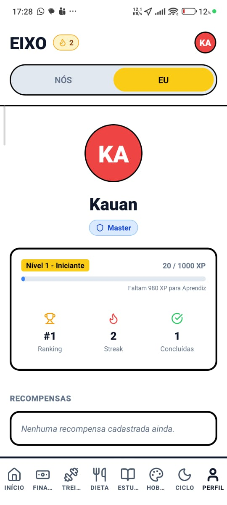

# Eixo 🏠

<div align="center">

**Aplicativo de gerenciamento familiar gamificado**

*Organize tarefas, finanças e rotina da família de forma divertida e colaborativa*

[English Version](#eixo---english-version)

</div>

---

## 📱 O que é o Eixo?

O **Eixo** é um aplicativo completo para gerenciamento familiar que transforma a organização do dia a dia em uma experiência gamificada. Cada membro da família pode acompanhar tarefas, finanças, metas e muito mais, enquanto ganha pontos e sobe de nível!

### ✨ Filosofia

O nome "Eixo" representa o centro em torno do qual a família gira - um ponto de equilíbrio que mantém todos conectados e organizados. O app funciona em dois modos:

- **Modo NÓS** 👨‍👩‍👧‍👦 - Recursos compartilhados da família
- **Modo EU** 👤 - Recursos pessoais de cada membro

---

## 🚀 Features

### 👨‍👩‍👧‍👦 Modo Família (NÓS)

#### 📋 Tarefas Domésticas
- Criação e atribuição de tarefas recorrentes
- Rotação automática de responsáveis
- Sistema de pontos por conclusão
- Bônus por completar antes do prazo

#### 💰 Finanças Familiares
- **Despesas** - Registro com divisão entre membros
- **Receitas** - Controle de entradas
- **Dívidas** - Parcelamentos com acompanhamento
- **Assinaturas** - Netflix, Spotify, etc.
- **Metas** - Poupança para objetivos em comum

#### 🛒 Lista de Compras
- Lista compartilhada em tempo real
- Marcar itens como comprados
- Quem adicionou cada item

#### 📅 Agenda Familiar
- Eventos e compromissos da família
- Sincronização entre todos

#### 🏆 Gamificação
- **Pontos** - Ganhe por completar tarefas
- **XP e Níveis** - Evolua com o tempo
- **Leaderboard** - Ranking familiar
- **Recompensas** - Resgate prêmios com pontos
- **Streaks** - Mantenha a sequência

#### 📢 Mural de Avisos
- Comunicados para toda família
- Alertas importantes

---

### 👤 Modo Pessoal (EU)

#### 🧘 Bem-estar
- **Hábitos** - Rastreie hábitos diários (água, exercício, etc.)
- **Treinos** - Registro de exercícios
- **Refeições** - Controle alimentar
- **Ciclo** - Acompanhamento menstrual (opcional)

#### 📚 Desenvolvimento
- **Hobbies** - Acompanhe projetos pessoais
- **Estudos** - Registro de sessões de estudo

#### 💳 Finanças Pessoais
- Controle de gastos individuais
- Separado das finanças da família

#### 🎁 Lista de Desejos
- Itens que você quer comprar
- Acompanhe quanto já economizou

---

## 🖼️ Prints das Funcionalidades

### 👨‍👩‍👧‍👦 Modo NÓS (Família)

| Tela | Preview |
|------|---------|
| Início: resumo da casa, lista de compras e atalhos da família |  |
| Mural da família com avisos e tarefas urgentes |  |
| Tarefas domésticas com rotinas, responsáveis e pontos |  |
| Lista de compras compartilhada com controle de itens |  |
| Perfil com nível, XP, streak e ranking |  |

### 👤 Modo EU (Pessoal)

| Tela | Preview |
|------|---------|
| Minhas finanças: saldo, entradas, saídas e histórico |  |
| Meus treinos: meta semanal, tempo total e calorias |  |
| Minha dieta: calorias, hidratação e refeições do dia |  |
| Guia de estudos: sessões, horas e metas semanais |  |
| Meus hobbies: projetos pessoais com progresso e metas |  |
| Perfil no modo EU com evolução e recompensas |  |

---

## 🏗️ Arquitetura

```
Eixo/
├── frontend/               # React Native + Expo
│   └── src/
│       ├── components/     # Componentes reutilizáveis
│       ├── screens/        # Telas do app
│       ├── context/        # Estado global (AppContext)
│       └── services/       # API e SignalR
│
└── backend/                # .NET 8 Web API
    ├── Eixo.Api/          # Controllers e Hubs
    ├── Eixo.Core/         # Entidades de domínio
    └── Eixo.Infrastructure/# EF Core + SQLite
```

---

## 🔧 Tecnologias

### Frontend
- **React Native** + Expo
- **TypeScript**
- **Lucide Icons**
- **SignalR** (real-time)
- **AsyncStorage** (auth)

### Backend
- **.NET 8** Web API
- **Entity Framework Core**
- **SQLite**
- **SignalR** (WebSockets)
- **JWT** Authentication

---

## 📡 API Endpoints

### Autenticação
| Método | Rota | Descrição |
|--------|------|-----------|
| POST | `/api/auth/login` | Login com PIN |
| POST | `/api/auth/quick-login` | Login rápido |
| GET | `/api/auth/me` | Usuário atual |

### Usuários
| Método | Rota | Descrição |
|--------|------|-----------|
| GET | `/api/users` | Listar usuários |
| GET | `/api/users/leaderboard` | Ranking |

### Tarefas
| Método | Rota | Descrição |
|--------|------|-----------|
| GET | `/api/tasks` | Listar tarefas |
| POST | `/api/tasks` | Criar tarefa |
| POST | `/api/tasks/{id}/complete` | Completar |

### Finanças
| Método | Rota | Descrição |
|--------|------|-----------|
| GET/POST | `/api/expenses` | Despesas |
| GET/POST | `/api/incomes` | Receitas |
| GET/POST | `/api/goals` | Metas |
| POST | `/api/goals/{id}/contribute` | Contribuir |

### Outros
| Módulo | Rota Base |
|--------|-----------|
| Compras | `/api/shopping` |
| Eventos | `/api/events` |
| Avisos | `/api/notices` |
| Recompensas | `/api/rewards` |
| Pessoal | `/api/personal/*` |

---

## 📱 Notificações em Tempo Real

O Eixo usa **SignalR** para atualizar todos os dispositivos instantaneamente:

| Evento | Quando acontece |
|--------|-----------------|
| `TaskCompleted` | Tarefa concluída |
| `RewardRedeemed` | Recompensa resgatada |
| `NewExpense` | Nova despesa |
| `GoalProgress` | Contribuição à meta |
| `ShoppingItemAdded` | Item adicionado à lista |
| `NewNotice` | Novo aviso no mural |

---

## 🚀 Como Rodar

### Pré-requisitos
- Node.js 18+
- .NET 8 SDK
- Expo CLI

### Backend
```bash
cd backend
dotnet run --project Eixo.Api --urls "http://localhost:5000"
```

### Frontend
```bash
cd frontend
npm install
npx expo start
```

### Credenciais Padrão
- **Usuários:** Ana, João, Maria
- **PIN:** 1234 (para todos)

---

## 📊 Banco de Dados

O app usa **SQLite** com as seguintes entidades:

- Users, UserSettings
- RecurringTasks, TaskAssignments
- Expenses, ExpenseSplits, Incomes
- Debts, Subscriptions
- Goals, GoalContributions
- ShoppingItems, Events
- Notifications, Notices
- Rewards, RewardRedemptions
- PersonalHabits, Hobbies, Wishlist
- PersonalTransactions, WorkoutSessions
- MealLogs, StudySessions, CycleDays

---

## 📄 Licença

MIT License - Use como quiser! 🎉

---

<br><br>

# Eixo - English Version

<div align="center">

**Gamified Family Management App**

*Organize tasks, finances, and routines in a fun and collaborative way*

</div>

---

## 📱 What is Eixo?

**Eixo** (Portuguese for "Axis") is a complete family management app that transforms daily organization into a gamified experience. Every family member can track tasks, finances, goals, and more while earning points and leveling up!

### ✨ Philosophy

The name "Eixo" represents the axis around which the family rotates - a balance point that keeps everyone connected and organized. The app works in two modes:

- **WE Mode** 👨‍👩‍👧‍👦 - Shared family resources
- **ME Mode** 👤 - Personal resources for each member

---

## 🚀 Features

### 👨‍👩‍👧‍👦 Family Mode (WE)

#### 📋 Household Tasks
- Create and assign recurring tasks
- Automatic rotation of assignees
- Points system for completion
- Bonus for early completion

#### 💰 Family Finances
- **Expenses** - Track with split between members
- **Incomes** - Control incoming money
- **Debts** - Installment tracking
- **Subscriptions** - Netflix, Spotify, etc.
- **Goals** - Savings for shared objectives

#### 🛒 Shopping List
- Shared real-time list
- Mark items as purchased
- Track who added each item

#### 📅 Family Calendar
- Events and family appointments
- Synced across all devices

#### 🏆 Gamification
- **Points** - Earn by completing tasks
- **XP & Levels** - Evolve over time
- **Leaderboard** - Family ranking
- **Rewards** - Redeem prizes with points
- **Streaks** - Maintain your sequence

#### 📢 Notice Board
- Family-wide announcements
- Important alerts

---

### 👤 Personal Mode (ME)

#### 🧘 Wellness
- **Habits** - Track daily habits (water, exercise, etc.)
- **Workouts** - Exercise logging
- **Meals** - Food tracking
- **Cycle** - Menstrual tracking (optional)

#### 📚 Development
- **Hobbies** - Track personal projects
- **Study** - Study session logging

#### 💳 Personal Finance
- Individual expense control
- Separate from family finances

#### 🎁 Wishlist
- Items you want to buy
- Track savings progress

---

## 🏗️ Architecture

```
Eixo/
├── frontend/               # React Native + Expo
│   └── src/
│       ├── components/     # Reusable components
│       ├── screens/        # App screens
│       ├── context/        # Global state (AppContext)
│       └── services/       # API and SignalR
│
└── backend/                # .NET 8 Web API
    ├── Eixo.Api/          # Controllers and Hubs
    ├── Eixo.Core/         # Domain entities
    └── Eixo.Infrastructure/# EF Core + SQLite
```

---

## 🔧 Tech Stack

### Frontend
- **React Native** + Expo
- **TypeScript**
- **Lucide Icons**
- **SignalR** (real-time)
- **AsyncStorage** (auth)

### Backend
- **.NET 8** Web API
- **Entity Framework Core**
- **SQLite**
- **SignalR** (WebSockets)
- **JWT** Authentication

---

## 🚀 Getting Started

### Prerequisites
- Node.js 18+
- .NET 8 SDK
- Expo CLI

### Backend
```bash
cd backend
dotnet run --project Eixo.Api --urls "http://localhost:5000"
```

### Frontend
```bash
cd frontend
npm install
npx expo start
```

### Default Credentials
- **Users:** Ana, João, Maria
- **PIN:** 1234 (for all)

---

## 📄 License

MIT License - Use it however you want! 🎉
